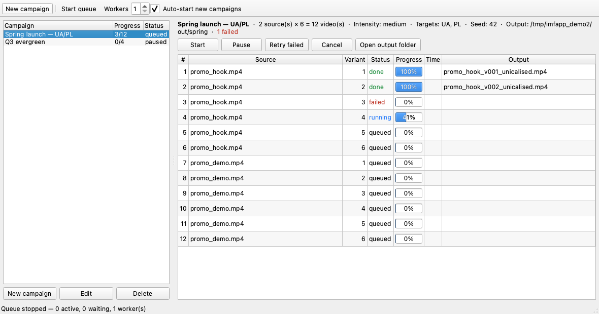
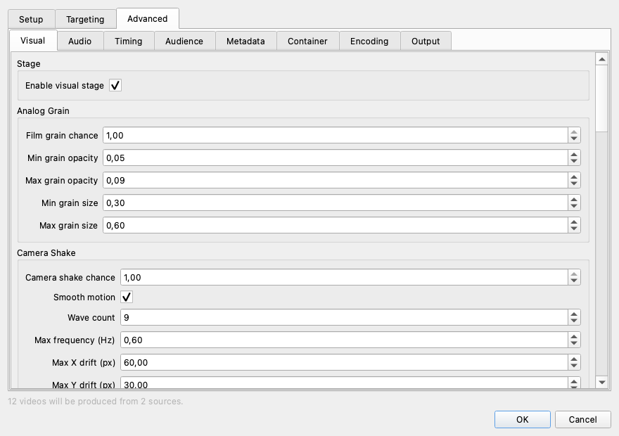

# impfactory-uni-apub
# Imp Factory Unicalisator

Desktop front end for [imf-unicalisator](../imf-unicalisator). Set up a batch of
campaigns, start the queue, and come back hours later to a folder of finished
variants.

It is a **single desktop process**. No server, no background daemon, no IPC — the
library is imported and called directly, on worker threads inside the app. Runs
on macOS and Windows.



- [Install and run](#install-and-run)
- [Signing in](#signing-in)
- [How it works](#how-it-works)
- [Campaigns](#campaigns)
- [The queue](#the-queue)
- [Where files go](#where-files-go)
- [Known limits](#known-limits)
- [Development](#development)

---

## Install and run
Download .zip for your platform, unzip an app an run it.

[Download for WINDOWS](https://app.notion.com/p/Windows-Unicalisator-3c19e5ca0a25804993e6ea873b66fa87)

[Download for MacOS](https://app.notion.com/p/MacOS-Unicalisator-3c19e5ca0a2580948617d405f9353cc7)

## NOTE: The bundles are unsigned

Neither is code-signed, so both operating systems will push back on first
launch. This is expected, not a broken build.

**macOS** — downloads are quarantined, and an unsigned app is refused outright.
Right-click → Open, then confirm; or clear the flag once:

```bash
xattr -dr com.apple.quarantine "/Applications/IMF Unicalisator.app"
```

**Windows** — SmartScreen shows "Windows protected your PC". More info → Run
anyway.

---

## Signing in

The app is gated behind a team sign-in. **Use your Generator credentials**.

## How it works

1. **Set up a campaign.** Pick source videos, how many variants you want from
   each, an intensity profile, and optionally which markets you are posting to.
2. **The campaign expands into jobs immediately** — one per output file. Ten
   sources × twenty variants is two hundred jobs, created and stored up front,
   so the app knows exactly how many files it owes you.
3. **Workers drain the queue** in the background while the window stays
   responsive.
4. **Come back later.** Progress survives quitting the app; a campaign resumes
   where it stopped.

The queue lives in SQLite, not in memory. That is the whole reason "set up forty
variants, quit, come back after dinner" works: on the next launch, any job that
was mid-flight is put back in the queue and picked up again.

---

## Campaigns

### Setup tab

| Field | Notes |
|---|---|
| Sources | Any number of videos. Each produces the full set of variants. |
| Variants per source | The multiplier. The dialog shows the resulting total before you commit. |
| Output folder | Defaults to a per-campaign folder under the app data directory. |
| Intensity | `None`, `Metadata only`, `Low`, `Medium` (recommended), `High`. Drives everything below it. A `Custom` entry appears the moment you drag a stage's bar or edit a value by hand, and disappears again once you pick a real preset. |
| What gets changed | One checkbox per pipeline stage, with its speed cost and a strength bar. |

**Intensity is the master control.** Changing it reloads both the stage
checkboxes and every value on the Advanced tab, so a stage you switched off
under one intensity never persists silently into another.

**What gets changed** lists the stages with an honest speed label on each,
measured rather than guessed (1080x1920 clip, each stage disabled in turn):

| Stage | Speed impact |
|---|---|
| Visual effects — grain, noise, colour drift, camera motion, sharpening | **Very slow · ~98% of the time** |
| Reframing — slight crop, zoom, resize | Negligible |
| Audio — volume, pitch, EQ | Negligible |
| Timing — trims frames, tiny speed change | Negligible |
| Metadata — tags, device identity, timestamps | Negligible |
| Container — file structure and brand | Negligible |
| Encoding — quality, codec profile, bitrate | Negligible |

The ranking is the opposite of most people's intuition, which is why it is on
the page rather than buried in docs: the one expensive stage contains the two
effects (grain and noise) that do the *least* against duplicate detection,
while reframing — the single most effective change — is free. Turning grain and
noise off in the Advanced tab cuts roughly three quarters of the runtime and
gives up very little.

Reframing runs inside the visual pass, so it greys out when Visual effects is
off, and the checklist warns when you disable either one.

**Each stage also carries a strength bar** — a high-level dial over that
stage's own slice of the Advanced tab, for tuning one stage without opening
it. Dragging one:

- writes straight into the matching Advanced-tab fields, blended along the
  line through that stage's own Low and High profile values (and a bit past
  either end, so the bar is not jammed against a stop at the presets
  themselves);
- switches Intensity to `Custom`;
- and, at the far left, switches the stage off — the checkbox and the bar
  cannot disagree, so ticking a stage back on from there gives it Low rather
  than leaving it checked but silent.

The number beside each bar is **not** a percentage of the bar's own travel —
that was tried and scrapped, because Low and High then land in the same two
spots for every stage regardless of how strong the profile actually made
them, which made the number tell you nothing beyond what the dropdown already
had. It is an index of how far up each parameter's *own allowed range* the
stage's settings sit, averaged across the stage, so two stages at the same
Intensity are comparable rather than reporting the same number by
construction. There is no fixed maximum to reach — that is deliberate, not a
bug, and the tooltip on each bar says so.

Metadata and Container have no bar: every value they carry is identical
across Low, Medium and High, so there is nothing for a bar to blend and one
would just be a control that visibly did nothing when dragged.

### Targeting tab

Target markets drive the metadata. One market is picked per variant and supplies
that variant's language, city, device and timezone **together**, so the metadata
stays internally consistent — a clip tagged Kyiv / Ukrainian / Samsung / 19:40
local rather than Tokyo / Ukrainian / iPhone / 03:00. Leave it empty for no
targeting.

### Advanced tab



Every one of the library's 110 parameters, grouped by stage.

This form is **built from the library's schema at runtime** — the app has no
hardcoded list of settings. Each descriptor carries its type, bounds, step and
choices, and the editor picks the right control from that. Add a parameter to
the library and it appears here on the next launch with no change to this app.

Settings are validated live against `validate_config()`; OK stays disabled while
anything is out of range, with the first problem shown at the bottom.

Changing the intensity reloads this tab from that profile, so treat it as
"pick a profile, then adjust".

The per-stage `apply` switches are deliberately **not** shown here — they live
on the Setup page as the "What gets changed" checkboxes. One setting with two
controls is a setting that can disagree with itself.

### Profile fidelity

`Low`, `Medium` and `High` reproduce vidage-service's hand-tuned profiles
exactly. Every visual parameter, every audio probability and every encoding
setting matches, including the values its code filled in at the call site for
keys the profiles omitted. `tests/test_vidage_parity.py` in the library pins
this so it cannot drift.

---

## The queue

The toolbar controls the pool; the per-campaign buttons control what is eligible
to run.

| Control | Effect |
|---|---|
| **Start queue** / **Stop queue** | Starts or stops the worker pool globally |
| **Workers** | How many jobs run at once. Default 1 |
| **Auto-start new campaigns** | New campaigns go straight to `queued` |
| **Start** / **Pause** (per campaign) | Whether this campaign's jobs are eligible |
| **Retry failed** | Re-queues just the failed jobs |
| **Cancel** | Cancels remaining jobs in the campaign |

Right-click any job row to reveal its output, re-run it, cancel it, or copy the
error. Double-click a finished job to reveal the file.

**Failures are per job, never per campaign.** A missing source or a clip with no
audio fails that one job and the worker moves on; the rest of the batch still
completes. The error is on the row, and **Retry failed** re-queues only those.

**Cancelling is cooperative.** A running job stops at its next progress tick
rather than being killed, so ffmpeg is never orphaned and no half-written file
is left behind. Expect a second or two, not instant.

### Worker count

More workers finish sooner. The cost is that the library seeds one
process-global RNG, so above one worker a seeded campaign stops replaying
exactly. The status bar says so whenever the count is above 1.

Workers are threads, not processes, and that is fine here: OpenCV's frame loop
releases the GIL and ffmpeg is a child process the worker only waits on.

### Sleep prevention

While the queue has at least started, the app holds an OS-level "stay awake"
assertion — `caffeinate -i -m` on macOS, `SetThreadExecutionState` on Windows —
and releases it the moment the queue stops. Only *system* sleep is prevented;
the display is free to turn off, since this is background work, not something
being watched.

This exists because a system sleep mid-batch does not just add wall-clock time
to a job. It can be long enough to trip ffmpeg's own stall-detection timeout on
the decoder, which then reports end-of-file — and without the library's
frame-count check (`imf-unicalisator`'s `video.py`), that produced a video
silently truncated to whatever fraction had decoded before the sleep hit. That
combination — one job in an overnight run finishing with 32 of 904 frames and
no error — is what motivated both halves of this fix. The frame-count check
means a stall now fails the job loudly instead of shipping a broken file; this
prevents the stall from happening in the first place.

If you still see a run take dramatically longer than its siblings on identical
settings without any error, that is more likely thermal or power throttling
under many hours of sustained full-CPU load than a sleep event — check
`pmset -g log | grep -iE 'Sleep|Wake|DarkWake'` (macOS) for actual sleep/wake
history, and prefer AC power for long unattended batches.

---

## Where files go

Outputs go wherever the campaign says. Everything else lives in the platform's
standard application-data location:

| | |
|---|---|
| macOS | `~/Library/Application Support/IMF Unicalisator/` |
| Windows | `%LOCALAPPDATA%\IMF Unicalisator\` |
| Linux | `~/.local/share/imf-unicalisator/` |

Set `IMF_UNICALISATOR_DATA_DIR` to relocate all of it — useful for a portable
install or a second profile.

Each finished job also leaves the library's JSON run log next to its video,
recording exactly which effects fired with which parameters.

---

## Known limits

- **A fixed seed replays the effect parameters, not the bytes.** Every random
  choice is reproduced — the same crop, grain, gamma, EQ and encoder settings.
  The file still differs between runs, because two fields are wall-clock derived
  by design: the metadata creation time, and the device-style title
  (`VID_20260619_150911`), which embeds the current date because that is what a
  phone writes. Compare the run log, not a checksum.
- **Seeds need a single worker.** Above 1, concurrent jobs interleave draws on
  one process-global RNG.
- **Cancelling waits for the next progress tick**, so it is not instantaneous.
- **Editing a campaign rebuilds only its unstarted jobs.** Work already finished
  is kept, and the files stay on disk.
- **Deleting a campaign keeps its output files** and removes only the queue
  records.
- **4K and larger sources are slow.** The visual pass can run over a second per
  frame at 8+ megapixels; `analog_grain` and `noise_overlay` dominate that cost
  and are also the weakest levers against perceptual hashing (a pHash is
  computed on a heavily downscaled frame, which is exactly where high-frequency
  noise gets thrown away). Disabling them in the Advanced tab, or downscaling
  the source before queuing it, is the fastest way to cut runtime on oversized
  video without giving up the effects that actually matter.

---
